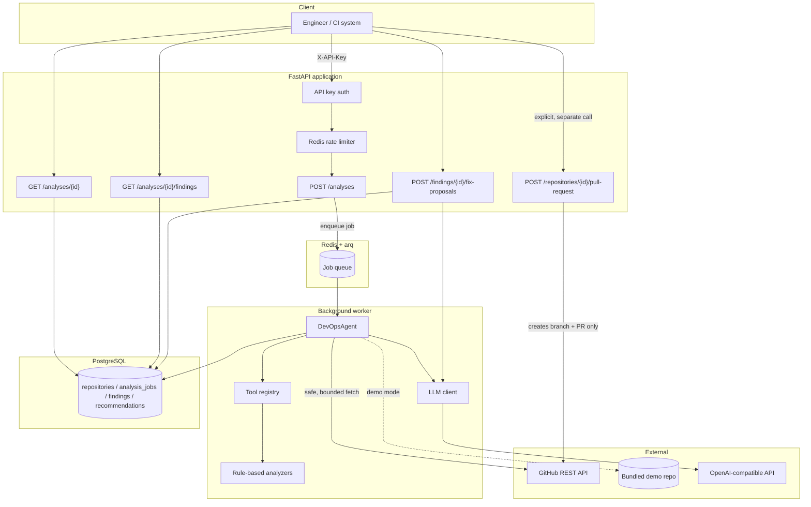
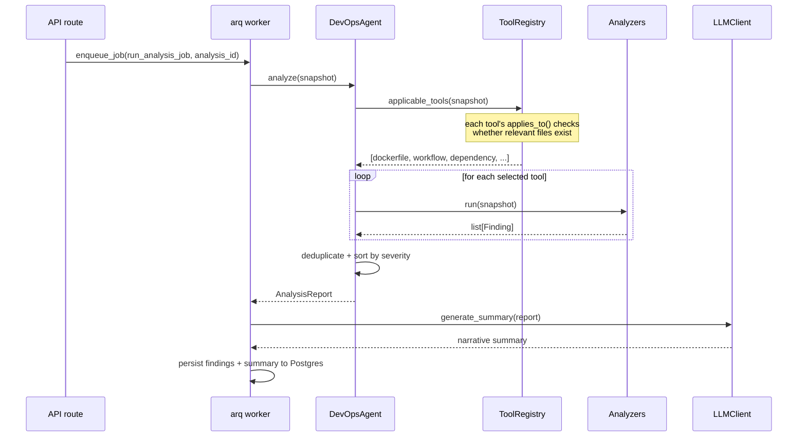

# ai-devops-copilot

**An AI-powered DevOps assistant that analyzes a GitHub repository and tells you, concretely, what's
wrong with its Dockerfiles, CI/CD workflows, dependencies, and deployment configuration — with
severity, rationale, and a suggested patch for each finding.**

It never modifies your repository automatically. Every fix is a proposed diff; opening a pull
request is a separate, explicit, human-triggered action.

[](.github/workflows/ci.yml)
[](pyproject.toml)
[](LICENSE)

---

## Table of contents

- [The problem](#the-problem)
- [Architecture](#architecture)
- [Design decisions](#design-decisions)
- [Agent architecture](#agent-architecture)
- [Security model](#security-model)
- [Example analysis](#example-analysis)
- [Example finding](#example-finding)
- [Local setup](#local-setup)
- [API examples](#api-examples)
- [Testing](#testing)
- [Limitations](#limitations)
- [Roadmap](#roadmap)

---

## The problem

Most repositories accumulate DevOps risk quietly: a Dockerfile that runs as root, a GitHub Actions
workflow that echoes a secret into logs, a `requirements.txt` with no version pins, a
`docker-compose.yml` that binds Postgres to `0.0.0.0`. None of these break the build. All of them
are the kind of thing a senior engineer catches in code review — if they happen to look at the
right file, on the right day.

`ai-devops-copilot` automates that review pass. It combines **deterministic static analysis**
(so the facts are reproducible and testable) with an **LLM** (so the output reads like a senior
engineer's comment, not a linter's error code) to produce structured, explained, severity-ranked
findings — and a concrete suggested fix for each one.

## Architecture



### Module layout

```
app/
  api/         FastAPI routes, request/response schemas, auth & DI wiring
  core/        config, structured logging, API-key auth, rate limiting, OpenTelemetry, LLM client
  agents/      DevOpsAgent orchestrator: tool selection, finding synthesis, fix generation
  tools/       MCP-shaped tool wrappers around each analyzer (name + description + schema)
  analyzers/   pure, deterministic rule engines (no I/O, no LLM) — one module per problem domain
  github/      GitHub REST client, safe repo-content fetcher, demo-repo loader, PR creation
  storage/     SQLAlchemy models, repositories (data-access layer), async session management
  workers/     arq background job that runs the actual analysis pipeline
  examples/
    demo_repo/ a small, intentionally-flawed repository used for demos and integration tests
                (bundled inside the app package so it ships in the installed wheel/image)
tests/
  unit/        analyzer, tool, agent, and GitHub-client tests (no network, no Docker)
  integration/ full API flow tests against SQLite + fakeredis (no Docker required)
```

Each layer only knows about the one below it: `api` depends on `agents` and `storage`; `agents`
depends on `tools` and `core.llm`; `tools` depend on `analyzers`; `analyzers` depend on nothing but
`agents.schemas`. Nothing lower in the stack imports FastAPI, SQLAlchemy, or an HTTP client — the
Dockerfile analyzer is a pure function you can unit test with a string.

## Design decisions

**Deterministic analyzers, LLM-assisted synthesis — not "ask the LLM to find bugs."**
Every finding's *facts* (what rule fired, which file, which line, the severity, why it matters)
come from small, regex/YAML-based rule engines in `app/analyzers/`. They're pure functions,
unit-tested in isolation, and produce the same output on the same input every time. The LLM is
used only where generation genuinely helps and hallucination is cheap to catch: drafting a unified
diff for a specific, already-identified problem, and writing a short executive summary. This
avoids the two failure modes of "LLM-only" DevOps tools: missed issues (the model didn't happen to
mention it) and fabricated issues (the model invented a rule that doesn't apply).

**Graceful degradation without an LLM key.** If `LLM_API_KEY` is unset or `LLM_ENABLED=false`,
`LLMClient` falls back to deterministic templates for both fix proposals and summaries instead of
failing. The full pipeline — analysis, findings, severities, explanations — works with zero LLM
calls, because the facts don't depend on the model. This is also why the test suite needs no API
key: `tests/conftest.py` runs with `LLM_ENABLED=false` and still exercises the whole agent.

**A bundled demo repository instead of a mocked GitHub API.** `app/examples/demo_repo/` is a real,
tiny repository with a real (intentionally bad) Dockerfile, workflow, `docker-compose.yml`, and
Python source file. `POST /api/v1/analyses` with `use_demo_fixture: true` runs the exact same
`DevOpsAgent` pipeline against it, with zero network calls. This is what backs both the "try it
locally in 30 seconds" experience and most of the integration test suite.

**PostgreSQL-and-SQLite-compatible storage layer.** Models use plain `JSON` and
`DateTime(timezone=True)` rather than Postgres-only types, so the identical schema runs against
`sqlite+aiosqlite` in tests and `postgresql+asyncpg` in production — no test-only ORM layer to
drift out of sync with the real one.

**arq over Celery.** The background-job surface here is one job type (`run_analysis_job`) with no
need for complex routing, chords, or multiple queues. `arq` gives Redis-backed async job execution
with a fraction of Celery's configuration surface — appropriate for what this service actually
does, not what a larger service might someday do.

## Agent architecture



`DevOpsAgent` (`app/agents/orchestrator.py`) is the orchestration layer:

1. **Tool selection.** Each `Tool` in the MCP-shaped `ToolRegistry` (`app/tools/`) exposes a
   `name`, natural-language `description`, and JSON-Schema-style `input_schema` — the same shape
   the Model Context Protocol uses to describe tools to an LLM. The default selection mode is
   deterministic (`Tool.applies_to(snapshot)` — "do I have a Dockerfile to look at?"), which is
   fast, free, and fully reproducible. An optional `tool_selection_mode="llm"` mode exists for
   genuinely ambiguous cases: it hands the tool list and a repo-structure summary to the LLM and
   asks it to choose, with a heuristic fallback if the model's response is unusable.
2. **Execution.** Selected tools run against a `RepoSnapshot` and return `Finding` objects.
3. **Synthesis.** Findings are deduplicated (by rule + file + line) and sorted by severity
   (critical → high → medium → low).
4. **Explanation & fix generation.** Every `Finding` already carries a human-readable
   `explanation` from its analyzer. `agent.propose_fix(finding)` asks the LLM for a concrete
   unified diff addressing *only* that finding; `agent.summarize(report)` asks for a short
   executive summary of the whole run.

### Tool catalog

| Tool | Analyzer | Detects |
|---|---|---|
| `analyze_dockerfiles` | `dockerfile_analyzer` | unpinned base images, root user, secrets in `ENV`/`ARG`, `curl \| bash`, missing `HEALTHCHECK`/`EXPOSE`, `ADD` misuse, apt bloat |
| `analyze_github_actions_security` | `workflow_analyzer` | `pull_request_target` + PR-head checkout, unpinned third-party actions, secrets echoed to logs, overly broad `permissions`, self-hosted runners on untrusted triggers, hardcoded credentials |
| `analyze_dependency_risk` | `dependency_analyzer` | unpinned/wildcard versions, missing lockfiles, packages with historically-known advisories |
| `analyze_cicd_mistakes` | `cicd_analyzer` | no CI at all, ignored test/lint failures (`continue-on-error`), no dependency caching, unguarded production deploys |
| `analyze_configuration` | `config_analyzer` | datastore ports bound to `0.0.0.0`, hardcoded secrets in `docker-compose.yml`, real-looking secrets in `.env.example`, missing restart policies |
| `analyze_reliability` | `reliability_analyzer` | bare `except: pass`, HTTP calls with no timeout, missing healthchecks/resource limits in compose |
| `inspect_repo_structure` | — | structural summary used for LLM-assisted tool selection; produces no findings |

## Security model

- **Read-only by default.** The GitHub client only performs read operations (repo metadata, tree
  listing, file contents) unless you explicitly call the pull-request endpoint.
- **One mutating code path, and it's opt-in.** `GitHubClient.create_pull_request_with_file` is the
  *only* function in the codebase that writes to a GitHub repository. It's reachable from exactly
  one API route (`POST /repositories/{id}/pull-request`), requires an authenticated request with a
  fully-specified file change, and is never invoked by the analysis or fix-proposal pipeline.
  Fix proposals are always diffs stored in Postgres — nothing is applied automatically.
- **Bounded, filtered repository fetching.** `SafeRepoFetcher` (`app/github/repo_fetcher.py`) caps
  file count and total bytes fetched, rejects path traversal (`..`, absolute paths), skips
  vendor/build directories (`node_modules`, `.git`, `dist`, …), and refuses to fetch secret-shaped
  files (`.env`, `.pem`, `id_rsa`, …) even if a repository owner accidentally committed them —
  we don't want to pull a real secret into an LLM prompt.
- **API-key authentication.** Every non-health endpoint requires `X-API-Key`, checked against a
  configured allow-list (`app/core/security.py`).
- **Redis-backed rate limiting.** A fixed-window limiter (`app/core/rate_limit.py`) caps requests
  per API key (or IP, if unauthenticated) to prevent abuse of the LLM-backed endpoints.
- **No secrets in prompts by construction.** Because analyzers already extract the specific
  finding (file, line, rule), fix-proposal prompts send only that finding's evidence — not whole
  files with unrelated secrets in them — to the LLM.

## Example analysis

Running the bundled demo repository through the pipeline surfaces 30+ findings across every
category. Severity breakdown from a real run:

| Severity | Count | Examples |
|---|---|---|
| Critical | 4 | hardcoded DB password in `Dockerfile` and `docker-compose.yml`, `curl \| bash` in `Dockerfile`, `pull_request_target` checking out untrusted PR head |
| High | 6 | container runs as root, secret echoed in workflow logs, vulnerable `pyyaml==5.0` pin, DB port bound to `0.0.0.0` |
| Medium | 12 | unpinned GitHub Action, ignored test failures (`continue-on-error`), unguarded prod deploy, missing lockfile |
| Low | 10+ | missing `HEALTHCHECK`/`EXPOSE`, no dependency caching, no restart policy, no resource limits |

## Example finding

```json
{
  "rule_id": "GHA001",
  "category": "github_actions",
  "severity": "critical",
  "title": "pull_request_target checks out untrusted PR head",
  "description": "This workflow triggers on `pull_request_target` (which runs with write-scoped secrets) and also checks out the PR head ref.",
  "explanation": "`pull_request_target` runs in the context of the base repository with full secret access. Checking out and executing the fork's code in that context lets any external contributor exfiltrate secrets or push to protected branches via a malicious pull request.",
  "file_path": ".github/workflows/deploy.yml",
  "line_number": null,
  "suggested_fix_summary": "Use `pull_request` instead, or if `pull_request_target` is required, never check out or execute untrusted PR code within it."
}
```

And the LLM-drafted fix proposal for a different finding in the same repo (`CONF002`, generated
live against a local Ollama model during development — see [Testing](#testing)):

```diff
--- a/docker-compose.yml
+++ b/docker-compose.yml
@@ -10,7 +10,7 @@ services:
     environment:
       DATABASE_HOST: db
       DATABASE_NAME: myapp
-      DATABASE_PASSWORD: secret_password
+      DATABASE_PASSWORD: ${DATABASE_PASSWORD}
```

## Local setup

Requires Docker and Docker Compose.

```bash
git clone <this-repo>
cd ai-devops-copilot
cp .env.example .env
docker compose up --build
```

This starts PostgreSQL, Redis, the FastAPI app (`:8000`), and the arq worker. Tables are
auto-created on first boot in local mode (`APP_ENV=local`); production deployments should run
Alembic migrations instead (`alembic upgrade head`).

Verify it's up:

```bash
curl http://localhost:8000/health
```

Run an analysis against the bundled demo repository (no GitHub token needed):

```bash
curl -X POST http://localhost:8000/api/v1/analyses \
  -H "X-API-Key: local-dev-key" \
  -H "Content-Type: application/json" \
  -d '{"owner": "ignored", "name": "ignored", "use_demo_fixture": true}'
```

To analyze a real repository instead, set `GITHUB_TOKEN` in `.env` (read-only scope is enough) and
POST with `use_demo_fixture: false` (the default) plus the real `owner`/`name`.

To point fix-proposal generation at a real model, set `LLM_API_KEY`, `LLM_BASE_URL`, and
`LLM_MODEL` in `.env` — any OpenAI-compatible endpoint works, including a local one (e.g. Ollama at
`http://localhost:11434/v1`).

### Running without Docker

```bash
uv venv --python 3.12
uv pip install -e ".[dev]"
export $(cat .env.example | xargs)  # or set DATABASE_URL to a local Postgres/SQLite
uvicorn app.main:app --reload
```

## API examples

All endpoints except `/health` require `X-API-Key`.

**Start an analysis**

```bash
curl -X POST http://localhost:8000/api/v1/analyses \
  -H "X-API-Key: local-dev-key" -H "Content-Type: application/json" \
  -d '{"owner": "octocat", "name": "hello-world", "ref": "main"}'
# -> {"id": "...", "status": "pending", ...}
```

**Poll status**

```bash
curl http://localhost:8000/api/v1/analyses/<id> -H "X-API-Key: local-dev-key"
```

**Retrieve findings**

```bash
curl http://localhost:8000/api/v1/analyses/<id>/findings -H "X-API-Key: local-dev-key"
```

**Generate a fix proposal for a finding**

```bash
curl -X POST http://localhost:8000/api/v1/findings/<finding_id>/fix-proposals \
  -H "X-API-Key: local-dev-key" -H "Content-Type: application/json" -d '{}'
```

**Open a pull request (explicit, separate action — never automatic)**

```bash
curl -X POST http://localhost:8000/api/v1/repositories/<repo_id>/pull-request \
  -H "X-API-Key: local-dev-key" -H "Content-Type: application/json" \
  -d '{
        "head_branch": "fix/dockerfile-user",
        "file_path": "Dockerfile",
        "file_content": "FROM python:3.12-slim\nUSER appuser\n...",
        "commit_message": "Run container as non-root user",
        "pr_title": "Fix: run container as non-root user"
      }'
```

Interactive OpenAPI docs are available at `/docs` while the app is running.

## Testing

```bash
uv run pytest                 # unit + integration, ~1s, no Docker/network required
uv run pytest --cov=app       # with coverage
uv run ruff check .           # lint
uv run ruff format --check .  # formatting
uv run mypy app               # type checking
uv run bandit -r app          # static security analysis
```

The full suite runs offline: SQLite backs storage, `fakeredis` backs both the rate limiter and the
job queue (jobs run inline instead of through a real arq worker), and `LLM_ENABLED=false` exercises
the deterministic fallback paths. `respx` mocks the GitHub REST API for client tests. Nothing in CI
requires a real database, Redis instance, GitHub token, or LLM API key.

The real LLM code path (not just the fallback) was verified during development against a local
Ollama endpoint (`qwen2.5-coder`) — see the fix-proposal diff in [Example finding](#example-finding),
which was generated that way, not hand-written.

Coverage focus:
- every analyzer rule has a positive and (where meaningful) a negative test case
- the agent's tool selection, deduplication, and severity ordering
- the full HTTP flow: auth rejection, demo analysis end-to-end, 404s, the PR-creation guard against
  the bundled demo repository
- the GitHub client's request/response handling, including the PR-creation code path

## Limitations

- **Rule coverage is representative, not exhaustive.** The analyzers demonstrate the pattern for
  each problem domain (Dockerfile, Actions, dependencies, CI/CD, config, reliability) with a
  focused set of high-value rules — this is not a drop-in replacement for Trivy, Hadolint, or
  Semgrep, and doesn't try to be.
- **The dependency-vulnerability list is illustrative.** `_KNOWN_VULNERABLE` in
  `dependency_analyzer.py` is a small, hardcoded set of historically-known advisories to
  demonstrate the analyzer pattern — not a live feed. A production deployment should replace it
  with an OSV or GitHub Advisory Database API call.
  Language coverage for analyzers is currently Python/Node-oriented (Docker and Actions analysis is
  language-agnostic).
- **Static analysis only.** There's no execution sandboxing, no dependency graph resolution, and no
  cross-file data-flow analysis (e.g. it won't trace a secret from one file into another).
- **Single-repository, single-ref analysis.** No cross-repository or historical-trend analysis yet.

## Roadmap

- Real vulnerability-database integration (OSV/GHSA) instead of the illustrative CVE list
- SARIF export for GitHub code scanning integration
- Incremental analysis (diff-only) for pull-request-triggered runs
- Additional language ecosystems (Go, Rust, Java) for dependency analysis
- A minimal web UI over the existing API
- Webhook-triggered analysis on push/PR events
